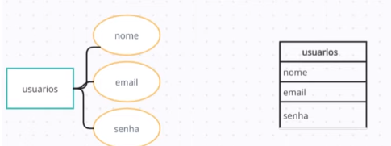

# Banco de Dados 

## O que é um Banco de Dados

- Uma coleção organizada de dados e armazenada de forma eletronica 

## Tipos de Banco de Dados
- Relacionais / SQL
- Não Relacionais / NoSQL
- Orientado a Objetos
- Hierárquico 

## SGBD

Um banco de dados geralmente não é auto controlavél então existem sistemas de gerenciamento de banco de dados eles vão nos fornecer conjuntos de ferramentas e recursos para criar os banco de dados, manipular administrar 

> Funcionalidades Básicas:

O famoso `CRUD`

- Create
- Read
- Update
- Delete

### Banco de dados relacionais

- Relacionamento entre tabelas
- Linguagem de Consulta Estrutura ( SQL )
- Integridade referencial
- Normalização de dados
- Segurança
- Flexibilidade e extensibilidade
- Suporte a transações ACID

> ACID
- Atomicidade ( Que garante que todas as ações de uma transação sejam executatas com sucesso ou que nenhuma seja executada )
- Consistência ( Garante que o banco de dados saia de um estado consistente para ir para outro estado consistente garantindo todas as regras e restrições )
- Isolamento ( Indica que cada interação seja executada de forma isolada sem interfirir em ações ao lado )
- Durabilidade ( Indica que cada alteração executada seja permanente )


## SQL

> Organização
- DQL - Linguagem de consulta de Dados
    - SELECT
- DML - Linguagem de manipulação de dados
    - INSERT, UPDATE, E DELETE
- DDL - Linguagem de definição de Dados
    - CREATE, ALTER, DROP
- DCL - Linguagem de controle de dados
    - GRANT, REVOLKE
- DTL - Linguagem de Transação de Dados
    - BEGIN, COMMIT, ROLLBACK

## Sintaxe Básica: Nomenclatura

- Os nomes devem começar com uma letra com um caractere de sublinhado (_)
- *** Os nomes podem conter letras, númeors e caracteres de sublinhado (_)
- Sensibilidade a maiúsculas e minúsculas

## MER e DER: Modelagem de Bancos de Dados

- O **`Modelo entidade-Relacionamento ( MER )`** é representado através de diagrmas chamados **`Diagramas entidade-relacionamento ( DER )`**

- MER : Utilizado para descrever os objetos ( entidades ) envolvidos em um dóminio de negócios, com suas características ( Atributos ) e como elas se relacionam entre si ( relacionamentos )

    Em geral, este modelo representa de forma abstrata a estrutura que possuirá o `banco de dados` da aplicação

> Entidades

As entidades são nomeadas com substantivos concretos ou abstratos que representem de forma clara sua função dentro do domínio, e elas são as representação das nossas tabelas

Em diagramas eles são representados por um retângulo, e observação dentro dessas entidades tem que ser bem especificio o que cada uma faz por exemplo a entidade de usuario não pode conter dados de reserva então essas coisas devem estar separadas


> Atributos

Os atributos são as características ou propriedades das entidades. eles descrevem informações específicas sobre uma entidade 

Os atributos precisam ter informações especificas daquela entidade 




> Relacionamentos 

Os relacionamentos representam as associações entre entidades


> Cardinalidade

Uma vez que as entidades são identificadas, deve-se então definir como se dá o relacionamento entre elas. De acordo com a quantidade de objetos envolvidos em cada lado do relacionamento, podemos classifica-los de três formas:

- Relacionamento 1..1 (um para um): cada uma das duas entidades envolvidas referenciam obrigatoriamente apenas uma unidade da outra. Por exemplo, em um banco de dados de currículos, cada usuário cadastrado pode possuir apenas um currículo na base, ao mesmo tempo em que cada currículo só pertence a um único usuário cadastrado.

- Relacionamento 1..n ou 1..* (um para muitos): uma das entidades envolvidas pode referenciar várias unidades da outra, porém, do outro lado cada uma das várias unidades referenciadas só pode estar ligada uma unidade da outra entidade. Por exemplo, em um sistema de plano de saúde, um usuário pode ter vários dependentes, mas cada dependente só pode estar ligado a um usuário principal. Note que temos apenas duas entidades envolvidas: usuário e dependente. O que muda é a quantidade de unidades/exemplares envolvidas de cada lado.

- Relacionamento n..n ou *..* (muitos para muitos): neste tipo de relacionamento cada entidade, de ambos os lados, podem referenciar múltiplas unidades da outra. Por exemplo, em um sistema de biblioteca, um título pode ser escrito por vários autores, ao mesmo tempo em que um autor pode escrever vários títulos. Assim, um objeto do tipo autor pode referenciar múltiplos objetos do tipo título, e vice versa.


## Basico De SQL

> Tabelas

Ela é usada para armazenar dados de forma organizada cada tabela em um banco de dados relacional tem um nome único e é dividida em colunas e linhas

> Colunas 

Uma coluna é uma estrutura dentro de uma tabela que representa um atributo específico dos dados armazenados. Cada coluna tem um nome único e um tipo de dados associado que define o tipo de informação que pode ser amazenado nela, como números, textos, datas, etc

- Registros

Um registro, também conhecido como linha ou tupla, é uma instância individual de dados em uma tabela


> Comando de criar uma tabela

- ***` CREATE TABLE {{nome da tabela}} ( {{coluna}} {{tipo}} {{opções}} COMMENT {{'COMENTARIO'}} ) `***


EX:

```sql

Create table usuario (id SERIAL PRIMARY KEY,nome varchar(50))

```

> Restrições de valor
    - NOT NULL
    - UNIQUE ( pode ser usado para garantir que exista somente um email por exemplo nao poder uasr o mesmo email pra 2 conta)
    - DEFAULT
- Chaves primárias e estrangeiras
- Auto Incremento


> Comando: INSERT

- Serve para inserir dados numa tabela
- ***` INSERT INTO {{nome da tabela}} ( coluna1, coluna2 ) VALUES ( valorColuna1, valorColuna2 ) `***
```sql

INSERT INTO usuario (nome) VALUES ('Erick Willian')

```


> Comando: SELECT
- ***`SELECT {{ lista_colunas }} FROM tabela`***

Select com condição 

- ***`SELECT {{ lista_colunas }} FROM tabela WHERE {{ condicao }}`***

> Comando: SELECT - Operadores
- = ( Igualdade )
- <> ou != ( desigualdade )
- ">" ( maior que )
- "<" ( menor que )
- ">=" ( maior ou igual que )
- "<=" ( menor ou igual que )
- LIKE ( comparação de padrões )
- IN ( pertence a uma lista de valores )
- BETWEEN ( dentro de um intervalo )
- AND ( e lógico )
- OR ( ou lógico ) 


> Comandos: Update:
- ***`UPDATE {{tabela}} SET {{coluna_1}} = {{novo_valor}} WHERE {{ Condição  }}`***

> Comando: Delete:
- ***`DELETE FROM {{ TABELA }} WHERE {{ condição }}`***
## Tipos de dados em uma tabela

Os dados podem variar muito entre os diversos SGBD, os mais comuns são:

- Inteiro ( Integer )
- Decimal / Numérico ( Decimal / Numeric )
- Caractere / Varchar ( Character / Varchar )
- Data / Hora ( Data / Time )
- Booleano ( Boolean )
- Texto Longo ( Text )

## Alterando e Excluindo Tabelas

> Problema

Usuários com endereços longos não estão conseguindo realizar cadastro no sistema

- Opções:
    - Recriar a tabela, migrar os dados e excluir a tabela anterior
    - Alterar estrutura da tabela

> Comando: Drop Table  

O comando DROP TABLE é usado no SQL - para remover uma tabela existente de banco de dados relacional

Ele exclui permanente a tabela

***`DROP TABLE {{ TABELA }}`*** 

> Comando: Alter Table

A cláusula ALTER TABLE é usada no SQL para modificar a estrutura de uam tabela existente em um banco de dados relacional

Ela permite:

- Adicionar, alterar ou excluiro colunas 
- Modificar as restrições, índices 
- Renomear a tabela entre outras alterações 


Aqui eu estou inserindo nas colunas os valores selecionados da tabela usuarios na nova tabela

- ***`INSERT INTO usuarios_novo ( id, nome, email, endereco, data_nascimento ) SELECT id, nome, email, endereco, data_nascimento FROM usuarios`***


Para alterar valores em uma tabela

- ***`ALTER TABLE usuarios_novo RENAME usuarios`***

Para alterar valores das colunas 

- ***`ALTER TABLE usuarios MODIFY COLUMN endereco VARCHAR( 150 )`***


## Chave Primária

- Identifica exclusivamente 
- Não pode conter valores ( NULL )
- Uma tabela pode ter apenas uma chave primária 

- ***`CREATE TABLE {{ TABELA }} ( ID PRIMATY KEY AUTOINCREMENT ) ALTER TABLE {{ tabela }} MODIFY COLUMN ID INT PRIMARY KEY`***

## Chaves Estrangeira

Ela é usada para estabelecer e manter a integridade dos dados entre tabelas relacionadas, ele faz referencia a chave primaria de uma tabela

- Pode ser nula ( NOT NULL )
- É possível ter mais de uma ( ou nenhuma ) em uma tabela

- ***`CREATE TABLE {{ tabela }} ( id INT PRIMARY KEY, chave_estrangeira INT, FOREIGN KEY ( chave_estrangeira ) REFERENCES {{ outra tabela }} (ID) )`***


Adicionar uma constraint serve para que elas sejam responsáveis pela integridade das tabelas 

```sql

ALTER TABLE viagens
ADD CONSTRAINT nome_constraint
FOREIGN KEY id_
REFERENCES usuarios ( id )
```

> Chaves Estrangeiras - Restrições 

Quando nós criamos chaves estrangeiras os comandos abaixo vao ajudar com o que vai acontecer com os filhos 

- ON DELETE especifica o que acontece com os registros dependentes quando um registro pai é excluído
- ON UPDATE define o comportamento dos registros dependentes quando um registro pai é atualizado
- CASCADE, SET NULL, SET DEFAULT e RESTRICT

## Normalização de Dados

A normalização de dados é um processo no qual se organiza e estrutura um banco de dados relacional de forma a eliminar redunâncias e anomalias, garantindo a consistência e integridade dos dados


> Formas Normais

1FN: Atomicidade de dados

- A 1FN estabelece que cada valor em uma tabela deve ser atômico, ou seja, indivisível. Nenhum campo deve conter múltiplos valores ou listas. No seu caso, o campo "endereco" contém múltiplos valores, como rua, número, cidade e estado. Para atingir a 1FN, precisamos dividir o campo "endereco" em colunas separadas
- Garante que cada valor seja atômico e que os registros sejam unicos e indetificáveis

2FN

- A 2FN estabelece que uma tabela deve estar na 1FN
- Todos os atributos não chave devem depender totalmente da chave primária
- Dica se sua tabela tem uma **chave primária simples** não existe a possibilidade de termos dependência parcial e por tanto ela ja se encontra na 2FN
- Garante que os atributos não chave dependam totalmente da chave primária, evitando dependências parciais

3FN

- Uma tabela deve estar na 2FN
- Nenhuma coluna não-chave pode depender de outra coluna não-chave
- Elimina dependencias transitivas entre os atributos não chave, garantindo que cada atributo não chave dependa apenas da chave primária, não havendo dependências indiretas entre eles


## Consultas avançadas

> Junções: JOINS

São usadas no SQL para combinar dados de duas ou mais tabelas relacionadas em uma única consulta


### Tipos de Junções

- INNER JOIN
    - Retorna apenas as linhas que têm correspondência em ambas as tabelas envolvidas na junção. A junção é feita com base em uma condição de igualdade especificada na cláusula ON
    - Ou seja ela retorna as linhas onde os elementos da tabela1 tem igual ao da tabela2
    ```sql

        SELECT * FROM tabela1 INNER JOIN tabela2 ON tabela1.coluna = tabela2.coluna

    ```
- LEFT JOIN ou LEFT OUTER JOIN
    - Retorna todas as linhas da tabela à esquerda da junção e as linhas correspondentes da tabela à direita. Se não houver correrspondencia, os valores da tabela à direita serão NULL
    ```sql

        SELECT * FROM tabela1 LEFT JOIN tabela2 on tabela1.coluna = tabela2.coluna

    ```
- RIGHT JOIN ou RIGHT OUTER JOIN
    - Retorna todas as linhas da tabela à direita da junção e as linhas correspondentes da tabela à esquerda. Se não houver correspondência, os valores da tabela à squerda serão NULL
    ```sql

        SELECT * FROM tabela1 RIGHT JOIN tabela2 ON tabela1.coluna = tabela2.coluna

    ```
- FULL JOIN ou FULL OUTER JOIN
    - Retorna todas as linhas de ambas as tabelas envolvidas na junção, conbinando-as com base em uma condição de igualdade. Se não houver correspondencia, os valores ausentes serão preenchidos com NULL
    ```sql

        SELECT * FROM tabela1 FULL JOIN tabela2 ON tabela1.coluna = tabela2.coluna

    ```
- Sub Consultas
    - Elas permitem realizar consultas mais conplexas permitindo que você use o resultado de uma consulta como entrada para outra consulta
    - As subconsultas podem ser usadas em várias partes de uma consulta:
        - SELECT
        - FROM
        - WHERE
        - HAVING
        - JOIN